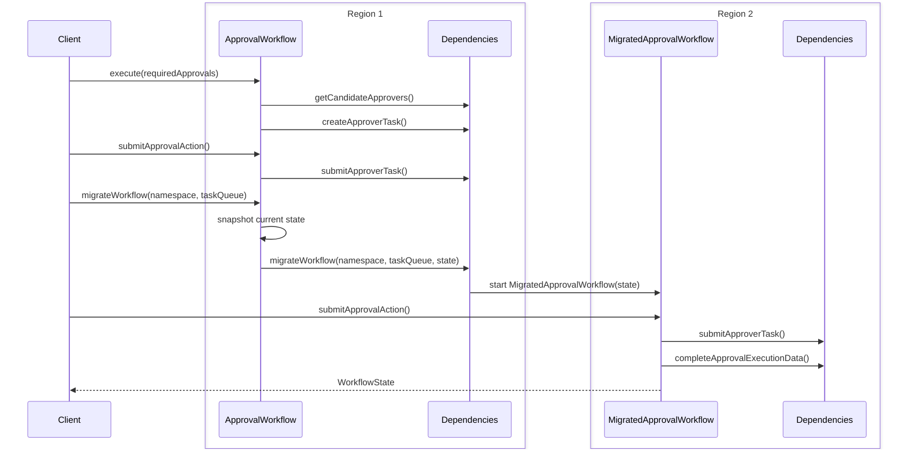

# Dedicated Migrate Workflow By Signal Sample

This sample builds on the [migrateWorkflowBySignal](../migrateWorkflowBySignal) pattern by introducing a dedicated `MigratedApprovalWorkflow` to handle the resumed execution in the target namespace.

## Key Difference from migrateWorkflowBySignal

In `migrateWorkflowBySignal`, the same `ApprovalWorkflow` is reused in the target namespace, which requires its `@WorkflowMethod` to accept a `WorkflowState` parameter to support both fresh starts and resumed migrations.

The original `ApprovalWorkflow` keeps its natural signature `execute(int requiredApprovals)`. The only additions needed are:
- A `migrateWorkflow(namespace, taskQueue)` signal handler to receive the migration trigger
- Internal state fields to snapshot before handing off

The dedicated `MigratedApprovalWorkflow` takes full ownership of the resumed execution, accepting `WorkflowState` as its input and completing the approval process from where the original left off.

## Workflow Flow



## Migration Guide

### Modifying the Existing Workflow (ApprovalWorkflow)

Add the following to your existing workflow — no changes to the core logic are needed:

1. Add state fields to capture a snapshot at migration time:
```java
private String newNamespace;
private String newTaskQueue;
private ApprovalTypes.CandidateApprovers candidateApprovers;
private ApprovalTypes.ApproverTask approverTask;
// plus any other fields that represent in-flight state
```

2. Add a `migrateWorkflow` signal handler:
```java
@Override
public void migrateWorkflow(String namespace, String taskQueue) {
    this.newNamespace = namespace;
    this.newTaskQueue = taskQueue;
}
```

3. In the `@WorkflowMethod`, add a concurrent migration branch alongside the existing approval logic:
```java
Promise<Void> migrationPromise = Async.function(() -> {
    Workflow.await(() -> newNamespace != null);

    ApprovalTypes.WorkflowState state = new ApprovalTypes.WorkflowState();
    state.setCandidateApprovers(candidateApprovers);
    state.setApproverTask(approverTask);
    state.setApprovalResults(approvalResults);
    state.setRequiredApprovals(requiredApprovals);
    state.setMigrated(true);
    state.getVersionMap().put(CREATE_APPROVER_TASK_VERSION, createApproverTaskVersion);

    activities.migrateWorkflow(newNamespace, newTaskQueue, state);
    return null;
});

// existing approval logic wrapped in approvalPromise ...

Promise.anyOf(migrationPromise, approvalPromise).get();
```

The `Promise.anyOf` ensures the original workflow exits as soon as migration fires, without waiting for approvals to complete.

### Creating the New Workflow (MigratedApprovalWorkflow)

The new workflow accepts `WorkflowState` as its input and resumes from where the original left off:

1. Restore versioning using the version map carried in the state:
```java
int createApproverTaskVersion = Workflow.getVersion(
    CREATE_APPROVER_TASK_VERSION,
    Workflow.DEFAULT_VERSION,
    state.getVersionFor(CREATE_APPROVER_TASK_VERSION)
);
```

2. Skip already-completed steps using null checks on the state:
```java
if (state.getCandidateApprovers() == null) { /* fetch */ }
if (state.getApproverTask() == null) { /* create */ }
```

3. Continue collecting approvals from where the original left off:
```java
while (state.getApprovalResults().size() < state.getRequiredApprovals()) {
    Workflow.await(() -> state.getApprovalAction() != null);
    // submit and collect results ...
}
```

## Running the Sample

```bash
./gradlew -q execute -PmainClass=io.temporal.samples.dedicatedMigrateWorkflowBySignal.Starter
```
