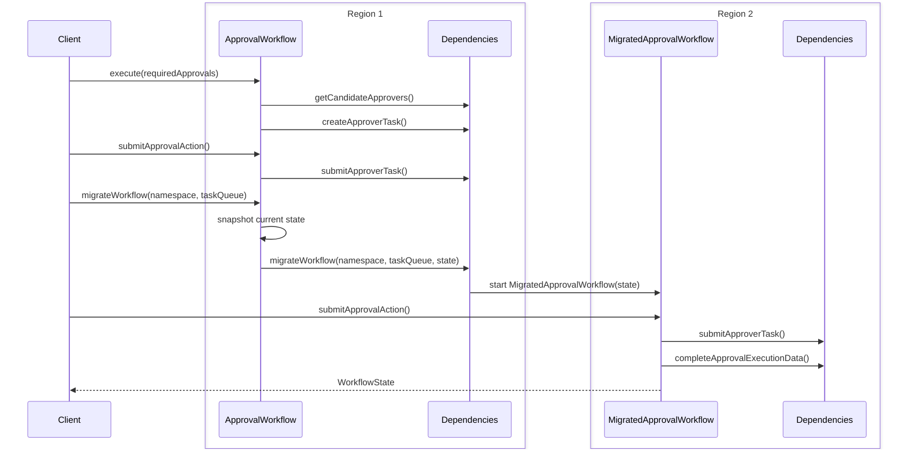

# Dedicated Migrate Workflow By Signal Sample

This sample builds on the [migrateWorkflowBySignal](../migrateWorkflowBySignal) pattern by introducing a dedicated `MigratedApprovalWorkflow` to handle the resumed execution in the target namespace.

## Key Difference from migrateWorkflowBySignal

In `migrateWorkflowBySignal`, the same `ApprovalWorkflow` is reused in the target namespace, which requires its `@WorkflowMethod` to accept a `WorkflowState` parameter to support both fresh starts and resumed migrations.

The original `ApprovalWorkflow` keeps its natural signature `execute(int requiredApprovals)`. The only additions needed are:
- A `migrateWorkflow(namespace, taskQueue)` signal handler to receive the migration trigger
- Internal state fields to snapshot before handing off

The dedicated `MigratedApprovalWorkflow` takes full ownership of the resumed execution, accepting `WorkflowState` as its input and completing the approval process from where the original left off.

## Workflow Flow



## Running the Sample

```bash
./gradlew -q execute -PmainClass=io.temporal.samples.dedicatedMigrateWorkflowBySignal.Starter
```
