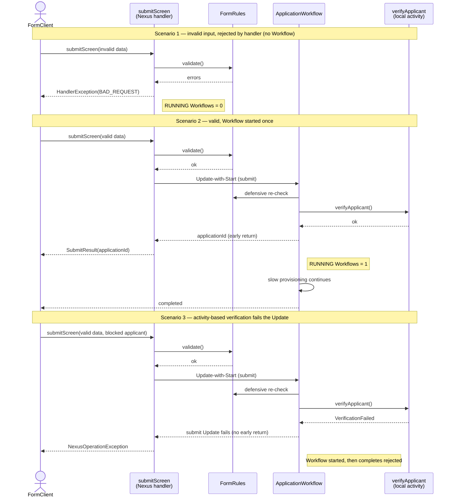

# Validate in the Nexus handler, start the Workflow only when valid

This sample shows how to gate Workflow creation behind validation. A single Nexus operation,
`submitScreen`, **validates first and only kicks off the Workflow when validation succeeds**.
Invalid input is rejected by the handler before any Workflow exists. On success, the handler starts
the one application Workflow via **Update-with-Start**, which returns an application ID early while
the Workflow keeps processing in the background.

It combines two techniques from the upstream samples:

- [Standalone Nexus operations](https://github.com/temporalio/samples-java/tree/main/core/src/main/java/io/temporal/samples/nexusstandalone)
  — a client invokes a Nexus operation directly, with no caller Workflow.
- [Early return](https://github.com/temporalio/samples-java/tree/main/core/src/main/java/io/temporal/samples/earlyreturn)
  — Update-with-Start starts a Workflow and returns a value synchronously while the Workflow keeps
  running.

## The problem this avoids

Suppose you validate a form with **Update-with-Start** against an entity Workflow (one Workflow per
in-progress application). Then you get **one Workflow Execution per user who so much as starts
Screen 1** — whether or not they ever submit anything valid. Most users abandon multi-screen forms
partway through, so you end up with:

- **Unbounded open Workflow count** — every abandoned or invalid attempt is a `RUNNING` execution
  sitting in visibility forever, because nothing ever completes it.
- **Operational noise** — dashboards fill with thousands of "in-progress" Workflows that are really
  just dead browser tabs; a genuinely stuck Workflow is impossible to spot.
- **Cost for zero business value** — each of those Workflows still cost a `start_workflow` Action
  plus an `accept_workflow_update` per screen the user got through.
- **Cleanup machinery you didn't want to build** — `WorkflowExecutionTimeout`s or a reaper job that
  queries visibility for idle executions and terminates them, purely to compensate for starting
  Workflows too early.

Note that Update-with-Start is **not atomic**: even a *rejected* Update still leaves a running
Workflow behind (see the sibling [`updateWithStart`](../updateWithStart) sample). So you can't fix
this by putting the check in the Workflow's Update validator — a rejected submission would still
create a Workflow.

## The fix

**The Nexus handler performs validation to stop the Workflow from being executed.** `submitScreen`
runs the validation itself; only if it passes does it start the Workflow. Invalid submissions throw
a `BAD_REQUEST` `HandlerException` and cost nothing — no Workflow is ever created.

Validation comes in **two tiers**:

1. **Stateless rules** ([`FormRules`](service/FormRules.java)) — cheap, synchronous field checks that
   run in the Nexus handler *before* any Workflow exists. A failure here creates nothing.
2. **Activity-based verification** (`verifyApplicant`) — a check that must call an external service
   (fraud/credit), so it can't run in the Nexus handler. It runs as a **local activity during the
   Workflow's initialization**, before the `submit` Update returns. A failure there propagates out of
   the Update, so the caller is still rejected — with a `NexusOperationException` and no application
   ID — even though the Workflow was technically started by the with-start.

| Outcome | What happens | Workflow created? |
| --- | --- | --- |
| Invalid input (stateless rules) | Handler throws `HandlerException(BAD_REQUEST)` | **No** |
| Valid input | Handler starts the Workflow via Update-with-Start, returns the app ID early | **Yes — once** |
| Fails activity-based verification | Local activity throws during init; the `submit` Update fails and the caller gets a `NexusOperationException` | **Yes, but completes rejected** |

The same [`FormRules`](service/FormRules.java) drive both the handler's gate and the Workflow's
defensive re-check at submit, so they can't drift apart.

## Flow



## Files

- [`service/FormNexusService.java`](service/FormNexusService.java) — Nexus service: the single
  `submitScreen` operation.
- [`service/FormRules.java`](service/FormRules.java) — stateless, Temporal-free validation rules.
- [`service/SubmitResult.java`](service/SubmitResult.java) — the early-return payload.
- [`handler/FormNexusServiceImpl.java`](handler/FormNexusServiceImpl.java) — `submitScreen`
  handler: validate → reject, or validate → kick off the Workflow via Update-with-Start.
- [`handler/ApplicationWorkflow.java`](handler/ApplicationWorkflow.java) /
  [`ApplicationWorkflowImpl.java`](handler/ApplicationWorkflowImpl.java) — the one Workflow, with the
  early-return `submit` Update.
- [`handler/ApplicationActivities*.java`](handler/ApplicationActivities.java) — mint the application
  ID (early-return value), run the activity-based `verifyApplicant` check (fails on the `@blocked.com`
  domain), and do the slow provisioning.
- [`handler/HandlerWorker.java`](handler/HandlerWorker.java) — hosts the Nexus service, Workflow, and
  activities on one task queue.
- [`FormClient.java`](FormClient.java) — runs three scenarios: invalid data (rejected, 0 Workflows),
  valid data (early return, 1 Workflow), and valid data that fails `verifyApplicant` (submit rejected
  even though a Workflow was started).

## Requirements

> [!WARNING]
> Standalone Nexus operations are **experimental** and require a Temporal server that implements
> them. Use the dev server build at
> <https://github.com/temporalio/cli/releases/tag/v1.7.4-standalone-nexus-operations>.

## Run it

1. Start the standalone-Nexus dev server:

   ```bash
   ./temporal server start-dev
   ```

2. Create a Nexus endpoint that routes to the handler's task queue (single namespace, `default`):

   ```bash
   ./temporal operator nexus endpoint create \
     --name form-validation-endpoint \
     --target-namespace default \
     --target-task-queue form-validation-queue
   ```

3. Start the worker:

   ```bash
   ./gradlew -q execute -PmainClass=io.temporal.samples.formValidation.handler.HandlerWorker
   ```

4. In another terminal, run the client:

   ```bash
   ./gradlew -q execute -PmainClass=io.temporal.samples.formValidation.FormClient
   ```

Expected output (abbreviated):

```
=== Scenario 1: invalid submission ===
Submission rejected by the Nexus handler (no Workflow started): ...Validation failed: [fullName is required, email must be a valid email address]
RUNNING ApplicationWorkflow executions after the invalid submission: 0 (expected 0)
=== Scenario 2: valid submission ===
Submit returned EARLY: Submission accepted. (applicationId=APP-...). Workflow keeps running.
RUNNING ApplicationWorkflow executions right after the valid submission: 1 (expected 1)
Workflow completed: Application processed successfully. (applicationId=APP-...)
=== Scenario 3: valid form, but fails activity-based verification ===
Submit rejected: activity-based verification failed the Update: ...Applicant failed background verification: mallory@blocked.com
```
