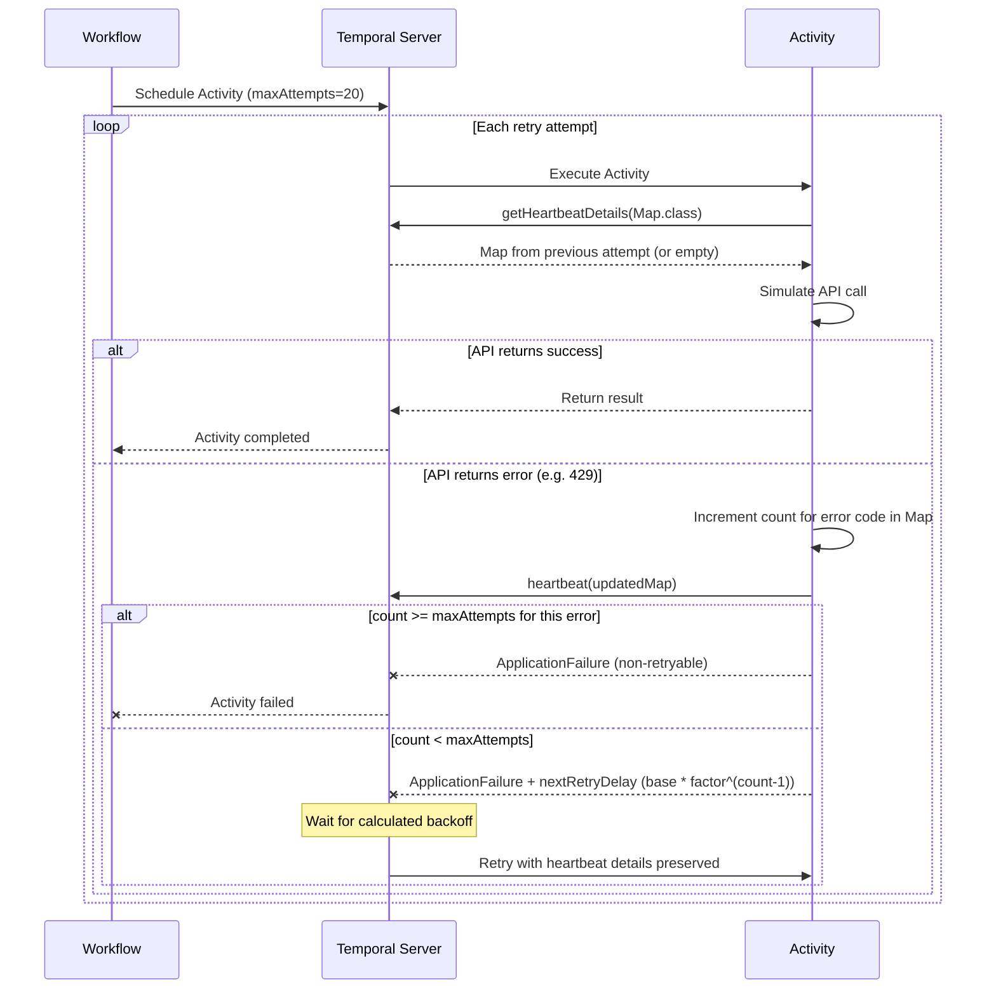

# Heartbeat Retry

Demonstrates using activity heartbeat details to maintain per-error-code retry counts and apply error-specific exponential backoff across activity retries.

## Pattern

The activity tracks how many times each HTTP error code has been encountered using a `Map<String, Integer>` stored in heartbeat details. Each error code has its own max attempts and base backoff duration. On failure, the activity uses `ApplicationFailure.newFailureWithCauseAndDelay` to override the retry policy's interval with a calculated exponential backoff.

## Key Features

- Heartbeat details (`Map<String, Integer>`) persist across activity retries via `getHeartbeatDetails`
- Independent retry tracking per error code (429, 401, 502)
- Per-error-code max attempts, backoff factor, and exponential backoff (`base * factor^(count-1)`)
- Custom next retry delay via `ApplicationFailure.newFailureWithCauseAndDelay`
- Non-retryable failure when an error code exceeds its max attempts

## Error Configuration

| Error Code | Max Attempts | Base Backoff | Factor | Scenario |
|------------|-------------|-------------|--------|----------|
| 429 | 5 | 2s | 2.0x | Rate limiting - generous retries with growing delay |
| 401 | 2 | 1s | 1.5x | Auth error - few retries, gentle backoff |
| 502 | 3 | 3s | 1.1x | Bad gateway - moderate retries, gentle backoff |

## How It Works



## Usage

Start the Temporal dev server:

```bash
temporal server start-dev
```

Run the sample:

```bash
./gradlew -q execute -PmainClass=io.temporal.samples.heartbeatRetry.Starter
```

## Expected Output

The simulated error sequence is `{429, 502, 429, 429, 502, 401, 502, 429}`. The activity retries through the errors, tracking counts independently per error code, until 502 hits its max of 3 retries:

```
Attempt 1: HTTP 429 (count 1/5) -> backoff 2s  (2*2.0^0) | counts: {429=1}
Attempt 2: HTTP 502 (count 1/3) -> backoff 3s  (3*3.0^0) | counts: {429=1, 502=1}
Attempt 3: HTTP 429 (count 2/5) -> backoff 4s  (2*2.0^1) | counts: {429=2, 502=1}
Attempt 4: HTTP 429 (count 3/5) -> backoff 8s  (2*2.0^2) | counts: {429=3, 502=1}
Attempt 5: HTTP 502 (count 2/3) -> backoff 3s  (3*1.1^1) | counts: {429=3, 502=2}
Attempt 6: HTTP 401 (count 1/2) -> backoff 1s  (1*1.5^0) | counts: {429=3, 502=2, 401=1}
Attempt 7: HTTP 502 (count 3/3) -> non-retryable          | counts: {429=3, 502=3, 401=1}

Workflow failed: Exceeded 3 retries for HTTP 502
```

## References

- [Activity Heartbeat](https://docs.temporal.io/develop/java/activities/timeouts#heartbeat-an-activity)
- [Activity Next Retry Delay](https://docs.temporal.io/develop/java/activities/timeouts#activity-next-retry-delay)
