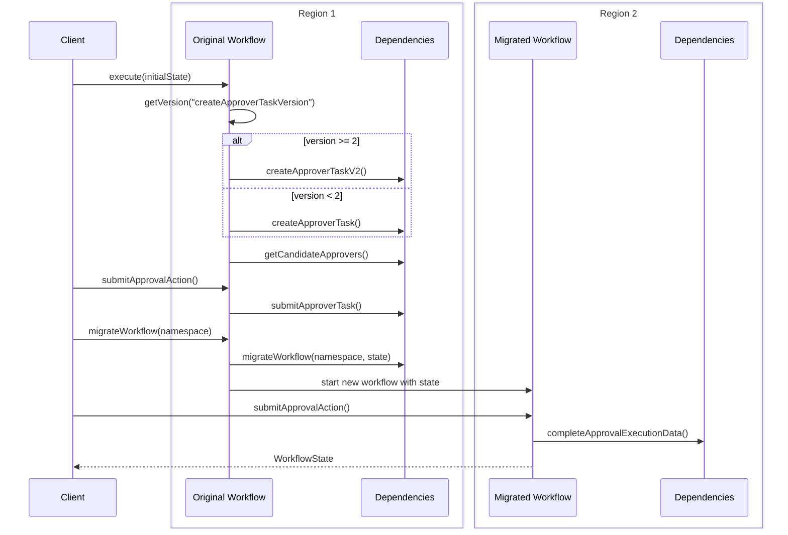

# Migrate Workflow By Signal Sample

This sample demonstrates how to migrate running workflows using signals, supporting scenarios such as migrating to a new namespace or moving from one region to another, while maintaining workflow state and version information.

## Key Features

- **Signal-based Migration**: Uses workflow signals to trigger migration to a new namespace
- **State Preservation**: Maintains workflow state during migration
- **Version Compatibility**: Preserves version information across namespace boundaries

## Workflow Flow



## Running the Sample

```bash
./gradlew -q execute -PmainClass=io.temporal.samples.migrateWorkflowBySignal.Starter
```

## Migration Process

The sample demonstrates:
1. Starting a workflow in the default namespace
2. Processing initial approval actions
3. Signaling the workflow to migrate to a new namespace
4. Continuing workflow execution in the new namespace
5. Completing the approval process
