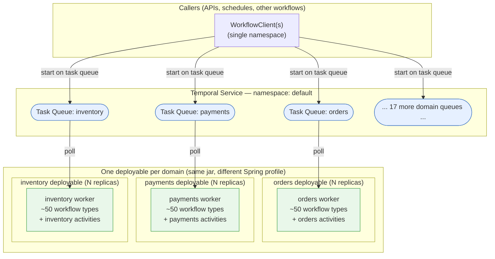

# Worker Deployment Patterns — 1,000 Workflows across 20 Domains

Architecture guidance (with a runnable Spring Boot reference implementation) for the common scaling
question:

> "We have ~1,000 workflow types spread across ~20 business domains. How should we lay out task
> queues, workers, and deployments?"

The short answer: **the unit of deployment is the domain, not the workflow.** You do not create 1,000
task queues or 1,000 workers. You create ~20 task queues (one per domain), run one worker fleet per
task queue, and deploy each fleet as its own independently scaled, independently released service.
This sample implements that pattern with three example domains — `orders`, `payments`, and
`inventory` — using the [Temporal Spring Boot integration](https://docs.temporal.io/develop/java/integrations/spring-boot-integration).

---

## TL;DR recommendation

| Decision | Recommendation for 1,000 workflows / 20 domains |
| --- | --- |
| **Namespace** | One namespace for the whole platform. Split only for hard isolation boundaries (compliance, tenancy, blast radius, per-team quotas). |
| **Task queues** | One per domain → ~20 task queues. Not one per workflow type, not one global. |
| **Workers** | One worker fleet per task queue. Many replicas per fleet for throughput/HA. |
| **Deployables** | One deployable per domain (same jar, different profile). ~20 deployables, scaled independently. |
| **Workflow ↔ worker** | All workflow types of a domain are registered on that domain's single worker. 1,000 types spread over 20 workers ≈ 50 types each — perfectly fine. |
| **Activity isolation** | Give an activity its own task queue only when it has a distinct resource profile (GPU, huge memory, an external system that rate-limits you, long-poll to a legacy host). |
| **Rollout** | Use Worker Versioning / Worker Deployments per fleet for safe, deterministic upgrades. |

---

## Why one task queue per domain?

Three tempting extremes, and why the middle is right:

- **One global task queue for everything (❌).** All 20 domains share pollers and worker slots. A
  slow or buggy domain starves every other domain (noisy neighbor). You cannot scale or deploy one
  domain without touching all of them. Every worker must load all 1,000 workflow types.
- **One task queue per workflow type — 1,000 queues (❌).** Massive operational sprawl, thousands of
  mostly-idle pollers, and no natural deployable boundary. A task queue is a *routing + load-balancing*
  primitive, not a per-type namespace. Registering 50 related workflow types on one worker is normal
  and cheap.
- **One task queue per domain — ~20 queues (✅).** The domain is the bounded context: it owns its
  workflows, its activities, its deploy cadence, and its scaling curve. This gives you isolation
  where it matters (between domains) without sprawl within a domain.

A Temporal worker can host many workflow and activity types with no meaningful per-type overhead, so
"50 workflow types on the orders worker" is the expected shape — not a smell.

## Why one deployable per domain?

Running all 20 domains in a single process is easy (this sample's `all` profile does exactly that for
local dev), but in production it costs you the things Temporal makes easy to get right:

- **Independent scaling.** `payments` might be I/O-bound on an external PSP; `inventory` might be
  CPU-bound. Separate deployables let you size pollers/slots and replica counts per domain.
- **Blast-radius isolation.** An OOM, a bad deploy, or a poison workflow in one domain does not take
  down the other 19.
- **Independent release cadence.** Each domain team ships on its own schedule. Worker Versioning is
  applied per fleet, so a non-deterministic change in one domain never risks another's history.
- **Clear ownership.** One repo module / CI pipeline / on-call rotation per domain.

The trade-off is ~20 deployables to operate. That is well within reach of any container platform
(one Deployment + HPA per domain in Kubernetes), and the isolation is worth it at this scale.

## Namespace strategy

Default to **a single namespace** for all 20 domains. Task queues already isolate routing and load,
and one namespace keeps cross-domain visibility, tooling, and client configuration simple. Reach for
multiple namespaces only when you need a *hard* boundary:

- Regulatory / data-isolation requirements (e.g. `payments` in a PCI-scoped namespace).
- Multi-tenancy where tenants must not see each other's workflows.
- Independent retention, rate limits, or quotas per group of domains.
- Separate blast radius for a very high-risk domain.

Note: one `WorkflowClient` targets exactly one namespace. If you split namespaces, each deployable
connects to its own namespace with its own client — which fits the one-deployable-per-domain model
cleanly. (The Spring Boot starter configures a single namespace per application; multiple namespaces
in one process means defining extra `WorkflowClient` beans yourself.)

---

## Deployment topology



Each caller starts a workflow **on the target domain's task queue**; the Temporal Service routes the
task to whichever replica of that domain's worker fleet is polling. Scaling a domain = adding
replicas to that one deployable. Nothing else changes.

---

## What this sample demonstrates

Three domains, each a self-contained package under
[`domain/`](.), each following the identical shape:

```
domain/orders/
  OrdersConstants.java      # TASK_QUEUE = "orders" — the domain's routing contract
  OrdersWorkflow.java       # @WorkflowInterface
  OrdersWorkflowImpl.java   # @WorkflowImpl(taskQueues = "orders")   <- wires workflow to the worker
  OrdersActivities.java     # @ActivityInterface
  OrdersActivitiesImpl.java # @Component @ActivityImpl(taskQueues = "orders") @Profile({"all","orders"})
```

The key mechanics:

- **`@WorkflowImpl(taskQueues = "...")` / `@ActivityImpl(taskQueues = "...")`** — auto-discovery
  creates a worker for each referenced task queue and registers the impls on it. This is how you'd
  register ~50 workflow types on one domain worker with zero wiring code.
- **`workers-auto-discovery.packages`** (per profile) scopes *which domain packages* a given process
  loads. A per-domain profile lists only its own package.
- **`@Profile({"all", "<domain>"})` on activity beans** — activity impls are `@Component`s, so
  Spring's component scan would instantiate *all* of them regardless of the auto-discovery package
  filter, silently starting workers for every domain. The profile gate is what actually enforces
  one-domain-per-process isolation. (Workflow impls are not Spring beans, so the package filter alone
  isolates them.)
- **Per-domain capacity tuning** lives in each `application-<domain>.yml` `workers.capacity` block,
  so every domain is sized for its own load profile.

### Profiles = deployment topologies

| Profile | Packages loaded | Workers started | Use |
| --- | --- | --- | --- |
| `all` | all domains | orders + payments + inventory (default capacity) | Local dev — one JVM hosts everything, plus a demo client. |
| `orders` | orders only | orders only (tuned capacity) | The production `orders` deployable. |
| `payments` | payments only | payments only (tuned capacity) | The production `payments` deployable. |
| `inventory` | inventory only | inventory only (tuned capacity) | The production `inventory` deployable. |

---

## Running the sample

**Prerequisites:** Java 17+ and a local Temporal dev server:

```bash
temporal server start-dev
```

### 1. Local dev — all domains in one JVM (and fire a demo workflow per domain)

```bash
./gradlew -q execute \
  -PmainClass=io.temporal.samples.workerDeployment.Application \
  -Pargs="--spring.profiles.active=all"
```

You'll see all three workers register, then one workflow started and completed on each task queue:

```
Started OrdersWorkflow on task queue 'orders' -> ...
Result from 'orders' worker: order ... fulfilled
Result from 'payments' worker: payment for order ... captured
Result from 'inventory' worker: stock reserved for order ...
Demo complete. Domain workers keep polling — press Ctrl+C to stop the process.
```

The process keeps running (the workers keep polling) — press `Ctrl+C` to stop it.

### 2. Production shape — one deployable per domain

Run each domain as its own process (in real life, one container image + a different profile per
Deployment):

```bash
./gradlew -q execute -PmainClass=io.temporal.samples.workerDeployment.Application -Pargs="--spring.profiles.active=orders"
./gradlew -q execute -PmainClass=io.temporal.samples.workerDeployment.Application -Pargs="--spring.profiles.active=payments"
./gradlew -q execute -PmainClass=io.temporal.samples.workerDeployment.Application -Pargs="--spring.profiles.active=inventory"
```

Each process starts **only its own** worker. Verify with:

```bash
temporal workflow start --task-queue orders --type OrdersWorkflow --workflow-id demo-orders --input '"ORD-1"'
temporal workflow result --workflow-id demo-orders
```

---

## Scaling from 3 domains to 20 (and 1,000 workflow types)

This sample is the pattern in miniature. To reach the full scale you only repeat it:

1. **Add a package per domain** under `domain/` with its `Constants`, workflow(s), and activities —
   up to ~50 workflow types per domain is fine on one worker.
2. **Add an `application-<domain>.yml`** with that domain's auto-discovery package and tuned
   `workers.capacity`.
3. **Gate each domain's activity beans** with `@Profile({"all", "<domain>"})`.
4. **Deploy the same jar 20 times**, one per profile, each as its own auto-scaled service.

Capacity, poller counts, and replica counts are then tuned per domain independently — see the
[`workerTuning`](../workerTuning) sample for how to size `max-concurrent-*` pollers and executors
using SDK metrics.

## Related guidance

- **Worker Versioning / Worker Deployments** — roll out new worker builds per fleet without breaking
  in-flight histories. Apply it per domain deployable. See the [`versioning`](../versioning) sample.
- **Dedicated activity task queues** — split an activity onto its own task queue (and its own scaled
  worker) when it has a distinct resource profile. See
  [`activityQueueSegregation`](../activityQueueSegregation).
- **Worker tuning & metrics** — [`workerTuning`](../workerTuning).
